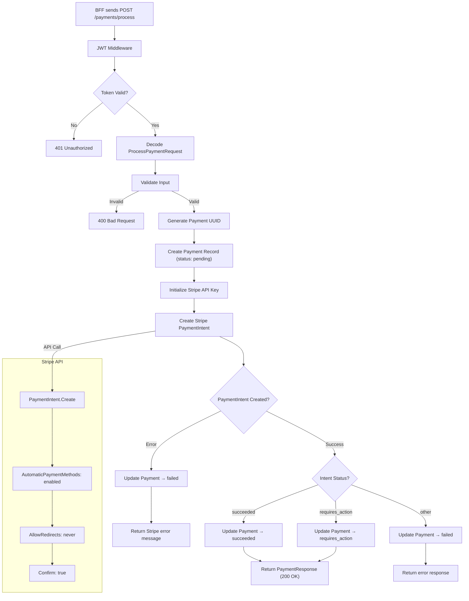
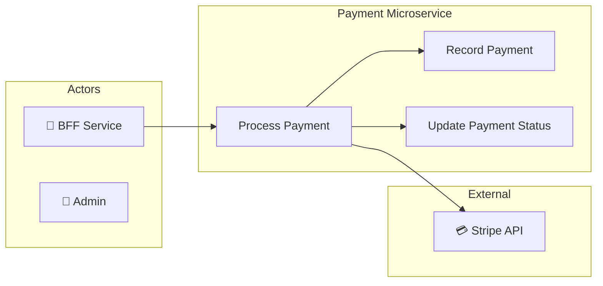
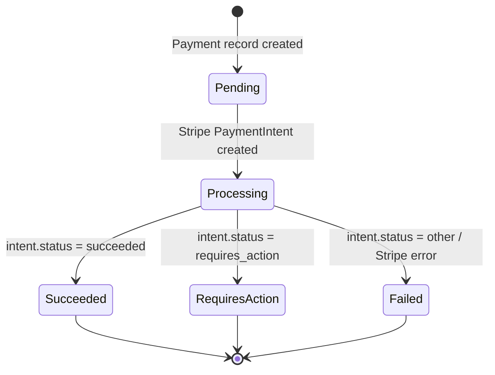
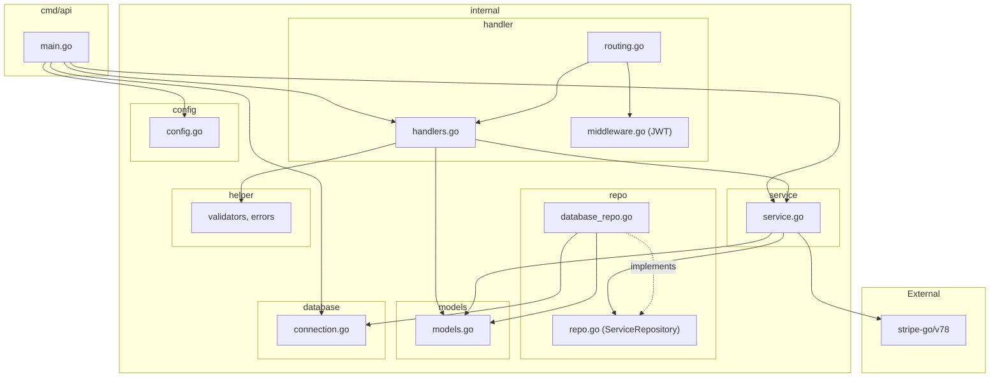

# 💳 Payment Microservice

> Stripe-integrated payment processing service for the Hotel Reservation Platform.

## Overview

The Payment Microservice handles **payment processing** via the [Stripe API](https://stripe.com/docs/api). It creates PaymentIntents, confirms payments with automatic payment methods, and persists payment records in PostgreSQL. The service is called by the BFF during the reservation creation flow to charge the guest before confirming the booking.

## Tech Stack

| Layer | Technology |
|---|---|
| Language | Go 1.25 |
| Router | [go-chi/chi](https://github.com/go-chi/chi) v5 |
| Database | PostgreSQL 16 |
| DB Driver | [pgx](https://github.com/jackc/pgx) v5 |
| Payment Gateway | [Stripe Go SDK](https://github.com/stripe/stripe-go) v78 |
| Auth | JWT verification (RSA-256 public key) |
| UUID | Google UUID v4 |
| Container | Docker (multi-stage Alpine build) |

## Architecture

```
app/
├── cmd/api/          # Application entrypoint
│   └── main.go
├── internal/
│   ├── config/       # YAML config loader
│   ├── database/     # PostgreSQL connection pool
│   ├── handler/      # HTTP handlers, routing, JWT middleware
│   ├── helper/       # Validators, error types, response helpers
│   ├── logging/      # Structured slog logger
│   ├── models/       # Domain entities (Payment, DTOs)
│   ├── repo/         # Repository interface + PostgreSQL implementation
│   └── service/      # Business logic (Stripe integration)
├── sql/
│   └── migrations/   # SQL migrations
├── config.yaml
├── Dockerfile
└── go.mod
```

## API Endpoints

### Public Routes

| Method | Path | Description |
|---|---|---|
| `GET` | `/health` | Liveness probe |
| `GET` | `/ready` | Readiness probe |

### Protected Routes (JWT Required)

| Method | Path | Description |
|---|---|---|
| `POST` | `/payments/process` | Process a payment for a booking |

## Data Model

### `payments` Table

| Column | Type | Description |
|---|---|---|
| `id` | UUID | Primary key |
| `booking_id` | UUID | FK → Booking service |
| `stripe_payment_intent_id` | VARCHAR | Stripe PaymentIntent ID |
| `amount` | FLOAT | Payment amount in USD |
| `status` | VARCHAR | `pending`, `succeeded`, `failed`, `requires_action` |
| `created_at` | TIMESTAMP | Record creation time |
| `updated_at` | TIMESTAMP | Last update time |

## Flow Diagram



## Use Case Diagram



## State Diagram



## Package Diagram



## Payment Processing Flow

1. **BFF** calls `POST /payments/process` with `booking_id`, `amount`, and `payment_method_id`
2. Service creates a **pending** payment record in the database
3. Service calls **Stripe PaymentIntent API** with:
   - Amount converted to cents
   - Currency: USD
   - PaymentMethod: provided by client (e.g., `pm_card_visa`)
   - AutomaticPaymentMethods: enabled
   - AllowRedirects: never (no 3D Secure redirect)
   - Confirm: true (immediate confirmation)
4. Based on Stripe response, payment status is updated to `succeeded`, `requires_action`, or `failed`
5. Response is returned to the BFF

## Configuration

### Environment Variables

| Variable | Description |
|---|---|
| `DATABASE_URL` | PostgreSQL connection string |
| `STRIPE_SECRET_KEY` | Stripe API secret key |

### Volume Mounts (Docker)

| Host Path | Container Path | Description |
|---|---|---|
| `./keys/public.pem` | `/app/keys/public.pem` | JWT verification key |

## Port Mapping

| Context | Port |
|---|---|
| Internal (container) | `8080` |
| External (host) | `8088` |
| Database (host) | `5438` → `5432` |
